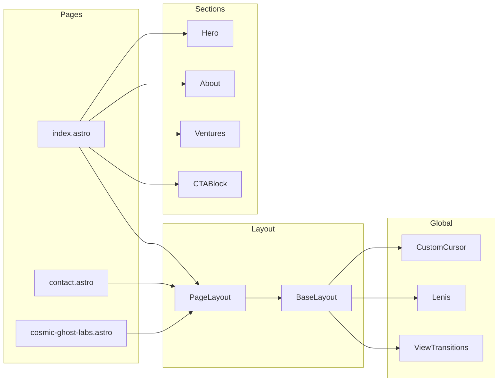

# nickscarabosio.com — Implementation Plan

**Use with Claude:** Open this file and say: *"Follow docs/BUILD_PLAN.md phase by phase. Start with Phase 1 and complete each step; after each phase confirm the deliverable before moving on."* Or reference it with @docs/BUILD_PLAN.md in chat.

---

## Current state

- **Workspace:** Empty repo (no `package.json`, no `src/`). Full greenfield build.
- **Spec:** Single-page home (Hero, About, Ventures, CTABlock) + `/contact` + `/ventures/cosmic-ghost-labs` skeleton. Astro, TypeScript, Tailwind, GSAP, Lenis, design tokens, Netlify Forms, Vercel deployment.

## Critical decision: Forms and hosting

**Conflict:** Spec specifies **Netlify Forms** and **Vercel** deployment. Netlify Forms only work when the site is deployed on Netlify; they are not available on Vercel.

**Options:**

1. **Deploy on Netlify** — Use Netlify Forms as specified; keep Vercel only for previews or drop it.
2. **Stay on Vercel** — Replace Netlify Forms with a Vercel-compatible solution:
   - **Formspree** (or similar): same `data-netlify="true"`-style `action` + hidden fields; minimal change to markup.
   - **Vercel Serverless + Resend/SendGrid**: API route receives form POST, sends email; form posts to `/api/contact`.

Recommendation: Decide before Phase 4. If staying on Vercel, use Formspree (or one form backend) and document the choice in the codebase.

---

## Architecture summary



---

## Phase 1 — Foundation

**Goal:** Astro + Tailwind + GSAP + Lenis + fonts + design tokens + base layout + custom cursor + smooth scroll. No content yet.

| Step | Action | Key files / commands |
| ---- | ------ | -------------------- |
| 1.1 | Create Astro app with TypeScript | `npm create astro@latest` (empty, strict TS, no install) |
| 1.2 | Add Tailwind | `npx astro add tailwind` |
| 1.3 | Install deps | `npm install gsap @studio-freight/lenis @fontsource/instrument-serif @fontsource/outfit` |
| 1.4 | Design tokens | `src/styles/global.css`: all `:root` vars from spec Section 3 (colors, fonts, type scale, spacing, motion). Wire Tailwind to use these (e.g. `theme.extend.colors` from CSS vars). |
| 1.5 | Keyframes | `src/styles/animations.css`: border pulse (Cosmic Ghost Labs), glitch (CGL page), any other keyframes; import in `global.css`. |
| 1.6 | BaseLayout | `src/layouts/BaseLayout.astro`: `<html>`, `<head>` (charset, viewport **without** `user-scalable=0`), meta, preload for Instrument Serif + Outfit, `global.css` + `animations.css`, `<ViewTransitions />` from `astro:transitions`, `<slot />`. No nav/footer here. |
| 1.7 | CustomCursor | `src/components/ui/CustomCursor.astro`: inner dot (8px) + outer ring (32px, accent border). Use `client:only="astro"` and a small script that uses `gsap.quickTo()` for position (lerp ~0.12 for ring). Hover: ring 48px + accent glow, hide dot. Click: scale 0.8 then release. Disable when `(pointer: coarse)` or `ontouchstart`. |
| 1.8 | Lenis + ScrollTrigger | In BaseLayout (or a small client script loaded once): init Lenis, `lenis.on('scroll', ScrollTrigger.update)`, `gsap.ticker.add((t) => lenis.raf(t * 1000))`, `gsap.ticker.lagSmoothing(0)`. Ensure Lenis is used as the scroll container if the spec expects it site-wide. |

**Deliverable:** App runs; one blank page with cursor and smooth scroll; tokens and fonts applied.

---

## Phase 2 — Nav and shell

**Goal:** Fixed nav, mobile overlay menu, footer, page layout that composes them.

| Step | Action | Key files |
| ---- | ------ | --------- |
| 2.1 | Nav | `src/components/layout/Nav.astro`: fixed, logo/wordmark left, links (About, Ventures, Contact) right, mobile hamburger. Optional: scroll-aware opacity. |
| 2.2 | MobileMenu | `src/components/layout/MobileMenu.astro`: full-screen overlay; open/close via GSAP timeline (e.g. scale/opacity); trigger from Nav. Use `client:load` or `client:idle` for the script that toggles and animates. |
| 2.3 | Footer | `src/components/layout/Footer.astro`: minimal — copyright "Nick Scarabosio", optional social links. |
| 2.4 | PageLayout | `src/layouts/PageLayout.astro`: BaseLayout + Nav + main slot + Footer. Use for all main pages. |

**Deliverable:** Shell works on a single placeholder page; nav links and mobile menu animate correctly.

---

## Phase 3 — Homepage sections

**Goal:** Hero, About, Ventures (cards + content collection), CTABlock; all wired in `index.astro` with scroll animations.

| Step | Action | Key files |
| ---- | ------ | --------- |
| 3.1 | Content schema | `src/content/config.ts`: ventures collection (schema from spec Section 8). Add `src/content/ventures/*.json` (e.g. `culture-to-cash.json`, `fractional-services.json`, `cosmic-ghost-labs.json`) with name, descriptor, status, url, urlLabel, internal. |
| 3.2 | Hero | `src/components/sections/Hero.astro`: full viewport; cursor-reactive background (particle field or gradient mesh moving toward cursor — keep subtle). GSAP on load: name stagger (e.g. word-by-word) fade + slide up 900ms `--ease-smooth`; then sub, meta, CTA (scale from 0.95), socials (horizontal stagger). Scroll indicator at bottom (pulse). Use `client:load` or `client:idle` for GSAP. |
| 3.3 | About | `src/components/sections/About.astro`: two-column desktop, one column mobile. ScrollTrigger: section in view (e.g. `start: 'top 80%'`) → heading slide + opacity, body lines with ~40ms stagger (SplitText or line-based). One column with slow parallax (y offset). Placeholder copy until Nick provides. |
| 3.4 | VentureCard | `src/components/ui/VentureCard.astro`: props for venture data + variant (active vs coming-soon). Active: hover lift, border brighten, accent glow. Coming-soon: dimmed, pulsing border (CSS keyframe from `animations.css`). |
| 3.5 | Ventures | `src/components/sections/Ventures.astro`: load ventures from content collection; three-column grid; each card staggered on scroll (e.g. `from({ opacity: 0, scale: 0.95 }, { stagger: 0.1, scrollTrigger: { trigger, start: 'top 80%', once: true } })`. |
| 3.6 | CTABlock | `src/components/sections/CTABlock.astro`: "Ready to talk?" + sub + Book a Call → `/contact`. Fade/slide on scroll (same ScrollTrigger pattern). |
| 3.7 | Shared UI | `src/components/ui/Button.astro` (primary/ghost), `src/components/ui/SocialLinks.astro` (icon row), `src/components/ui/SectionLabel.astro` (overline) as needed. |
| 3.8 | Homepage | `src/pages/index.astro`: PageLayout; sections in order — Hero (`id="hero"`), About (`id="about"`), Ventures (`id="ventures"`), CTABlock; anchor links from nav. |

**Deliverable:** Homepage complete with copy placeholders; all sections animate on scroll; ventures data-driven.

---

## Phase 4 — Standalone pages

**Goal:** Contact form (with chosen form backend) and Cosmic Ghost Labs skeleton.

| Step | Action | Key files |
| ---- | ------ | --------- |
| 4.1 | Form backend | Resolve Netlify vs Vercel: if Vercel, implement Formspree (or API route + email). Document in README or env. |
| 4.2 | Contact page | `src/pages/contact.astro`: PageLayout; centered form — First Name, Last Name, Email, Message (all required), Submit "Send a Message". Use `--color-bg-secondary`, `--color-border`; focus `--color-accent`. If Formspree: `action` to Formspree URL, hidden fields; success: inline thank-you (replace form, no reload). If Netlify: `data-netlify="true"` + `form-name` only when deploying to Netlify. |
| 4.3 | CGL skeleton | `src/pages/ventures/cosmic-ghost-labs.astro`: full viewport; dark; slow particle/noise background; headline "Cosmic Ghost Labs" with one-time glitch or fragmented entrance (GSAP); sub and body copy from spec; "Get notified" + email CTA; minimal back link to home. Pulsing accent element. |

**Deliverable:** Contact form submits and shows success; CGL page has distinct "coming soon" feel and motion.

---

## Phase 5 — Polish and launch

**Goal:** SEO, sitemap, OG image, Vercel adapter, redirects, a11y, Lighthouse.

| Step | Action | Key files / commands |
| ---- | ------ | -------------------- |
| 5.1 | View Transitions | Ensure `transition:animate="fade"` (or named) on main content where needed; hero cross-page morph optional. |
| 5.2 | Sitemap | `npx astro add sitemap`; confirm `/sitemap-index.xml` in build. |
| 5.3 | Meta | In BaseLayout (or per-page override): title "Nick Scarabosio — Operator, Coach, Builder", description, canonical, OG tags, Twitter card; OG image `https://nickscarabosio.com/images/og-card.png`. |
| 5.4 | OG image | Add `public/images/og-card.png` 1200×630, dark branded (placeholder acceptable for dev). |
| 5.5 | Vercel | `npx astro add vercel`; ensure build and preview work. |
| 5.6 | Redirects | Vercel: `vercel.json` redirects array. Spec: `/rants/` → `/writing/`, `/bookacall/` → `/contact/`, `/about/` → `/#about`. |
| 5.7 | Accessibility | Keyboard nav, visible focus states, contrast (tokens already chosen). No `user-scalable=0`. |
| 5.8 | Lighthouse | Target Perf 95+, A11y 100, BP 100, SEO 100; LCP < 2.5s, CLS < 0.1. Optimize images with `<Image />`, preload fonts, load GSAP only where needed (`client:load`/`client:idle`). |
| 5.9 | DNS | After QA: point nickscarabosio.com to Vercel (spec: cutover from GoDaddy). |

**Deliverable:** Production-ready build, redirects live, meta and sitemap correct; DNS cutover is a manual step post-approval.

---

## File tree (target)

```
src/
  components/
    layout/     Nav.astro, Footer.astro, MobileMenu.astro
    sections/   Hero.astro, About.astro, Ventures.astro, CTABlock.astro
    ui/         VentureCard.astro, Button.astro, SocialLinks.astro,
                CustomCursor.astro, SectionLabel.astro
  content/
    config.ts
    ventures/   *.json (culture-to-cash, fractional-services, cosmic-ghost-labs)
  layouts/      BaseLayout.astro, PageLayout.astro
  pages/        index.astro, contact.astro, ventures/cosmic-ghost-labs.astro
  styles/       global.css, animations.css
public/
  images/       og-card.png
vercel.json     redirects
```

---

## Open items (spec Section 13)

- **Hero / About copy** — Use placeholders until Nick provides.
- **Social links** — Which platforms; wire in Hero + Footer.
- **Photo** — Placeholder div/size in place; drop in asset when ready.
- **Cosmic Ghost Labs** — Logo/wordmark vs typographic treatment.
- **Book a Call** — Calendly or booking URL (e.g. link from `/contact` or CTA).
- **Email** — Confirm `nick@nickscarabosio.com` and routing before DNS cutover.
- **Fractional Services** — Exact descriptor for the card.

---

## Risk and notes

- **Cursor + Lenis:** Test on real devices; ensure no jank (use `requestAnimationFrame` and `quickTo` as specified).
- **Spline/Three.js:** Spec marks 3D as optional; skip in v1 unless explicitly added; prefer Spline if needed.
- **Netlify Forms on Vercel:** Not supported; must resolve in Phase 4 (see decision above).
